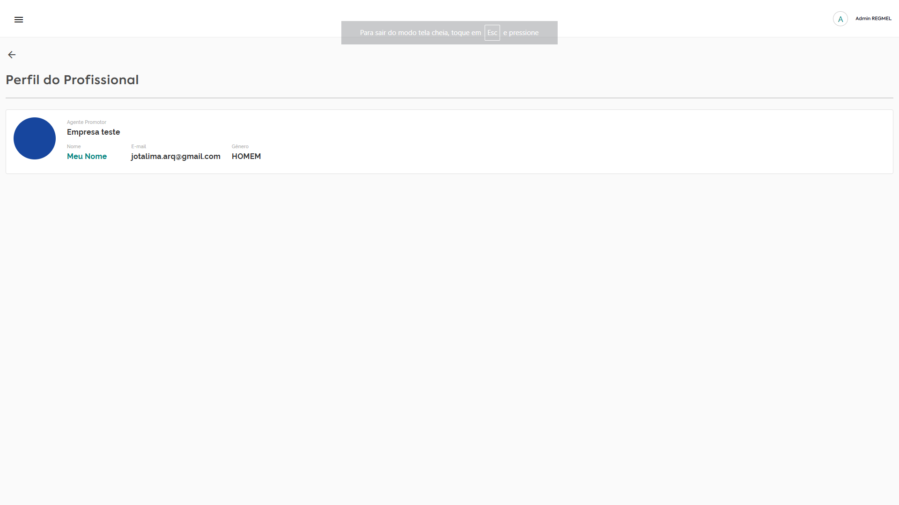

# Gerenciar profissionais

### Acessar lista de profissionais

Para visualizar os profissionais, basta acessar o menu lateral e clicar em `Profissionais` e a página com a lista será exibida.

<figure><figcaption></figcaption></figure>

### Visualizar detalhes do profissional

Para visualizar os detalhes e informações de um profissional cadastrado, basta clicar no `ícone de detalhes (Usuário com uma lupa)` ao lado das informações do profissional na lista.

<figure><figcaption></figcaption></figure>
