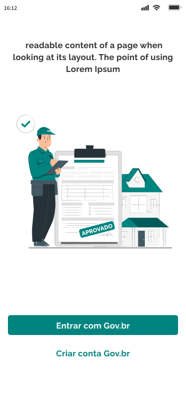

# Acessar com GOV.BR

O primeiro passo para utilizar o sistema, é acessar sua conta, para isso, é necessário efetuar o Login utilizando sua conta [gov.br](https://www.gov.br/pt-br)&#x20;

Para isso, clique em `Entrar com Gov.br`

<figure><figcaption></figcaption></figure>

Informe seu 'CPF' e clique em `Continuar`

<figure><figcaption></figcaption></figure>

Informe sua 'Senha' de acesso e clique em `Entrar`

<figure><figcaption></figcaption></figure>

### Primeiro acesso

Caso seja o seu primeiro acesso no sistema, uma página de escolha de tipo de programa será exibida com as seguintes opções:

* Minha Casa Minha Vida: Para usuários que aderirem à modalidade financiada.&#x20;
* Regularização e Melhorias: Para usuários que aderirem à modalidade subsidiada.

Escolha 'Regularização e Melhorias' e clique em `Confirmar`

<figure><figcaption></figcaption></figure>

Então, uma página de escolha de tipo de usuário será exibida com as seguintes opções:

* **Sou morador(a):** Para usuários que gostariam de realizar uma melhoria habitacional em sua residência.
* **Sou agente promotor:** Para usuários que gostariam de realizar obras de melhoria habitacional.

Escolha 'Agente promotor' e clique em `Confirmar`

<figure><figcaption></figcaption></figure>

Na página exibida, preencha os campos de informações pessoais solicitadas pelo sistema:

* Nome
* CPF
* Telefone para contato
* E-mail

Clique em `Avançar`

<figure><figcaption></figcaption></figure>

Na segunda etapa exibida, preencha os campos de informações complementares solicitadas pelo sistema:

* Sobre você (Caixa de exto)
* Portfólio (Opcional)
* Foto de perfil (inserir arquivo de imagem)
* Sexo
* Escolaridade
* Mês de formação
* Ano de formação
* Estado civil
* Renda familiar mensal
* Cor ou raça

Clique em `Confirmar`

<figure><figcaption></figcaption></figure>
