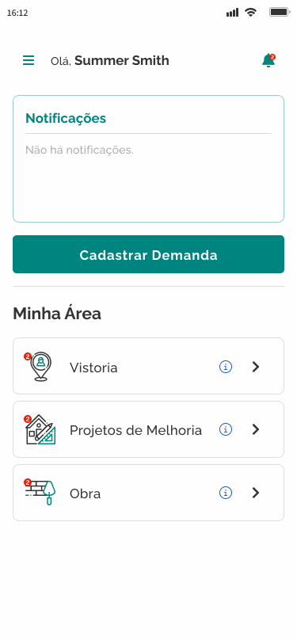
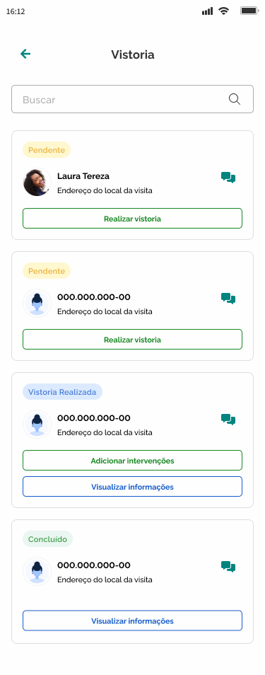

# Adicionar intervenções

Para adicionar as intervenções que serão realizadas, primeiro o promotor deverá realizar a vistoria em:


[realizar-vistoria.md](realizar-vistoria.md)


Para adicionar intervenções, acesse a tela inicial&#x20;

Clique em `Vistoria`

<figure><figcaption></figcaption></figure>

Na página exibida, selecione um item com o status 'Vistoria Realizada' na lista de vistorias

Clique em `Adicionar intervenções`

<figure><figcaption></figcaption></figure>

Na página exibida, preencha os dados solicitados pelo sistema

* Cômodos que gostaria de melhorar
* Tipo de intervenção para cada cômodo

Clique em `Salvar`

<figure><figcaption></figcaption></figure>

