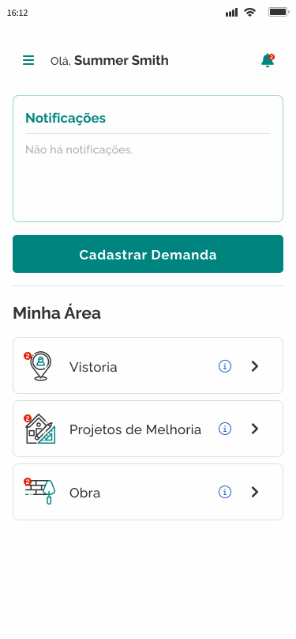

# Cadastrar demanda

Para cadastrar uma demanda, acesse a tela inicial&#x20;

Clique em `Cadastrar demanda`

<figure><figcaption></figcaption></figure>

Na página exibida, preencha os dados solicitados pelo sistema

* CPF do morador
* CEP
* Estado
* Cidade
* Endereço
* Bairro
* Numero
* Complemento

Clique em `Salvar`

<figure><figcaption></figcaption></figure>
